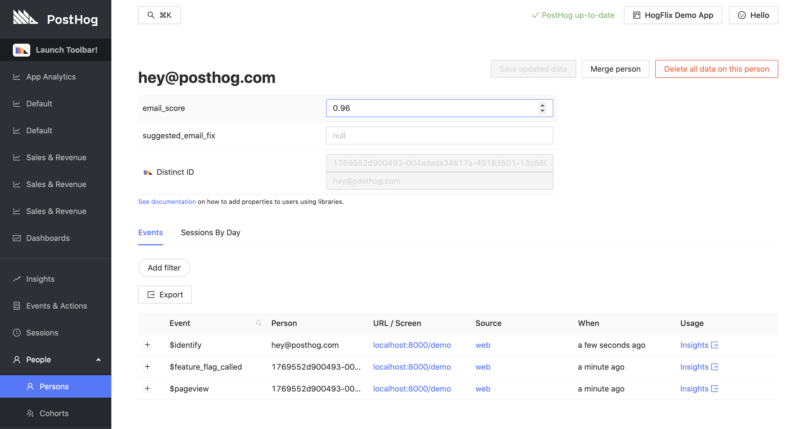

# Email Scoring (Mailboxlayer) Plugin

This plugin is deprecated.

Get email scores for users using the Mailboxlayer API and add them to PostHog user profiles. Suggested fixes will also be added if available.

## Installation

1. Visit 'Project Plugins' under 'Settings'
1. Enable plugins if you haven't already done so
1. Click the 'Repository' tab next to 'Installed'
1. Click 'Install' on this plugin
1. Sign up to [Mailboxlayer](https://mailboxlayer.com/)
1. Get an API key from Mailboxlayer
1. Click '+ Install new plugin' and use this URL to install: `https://github.com/PostHog/mailboxlayer-plugin`
1. Add the API key to the plugin config
1. Enable the plugin and watch the email scores come in!
